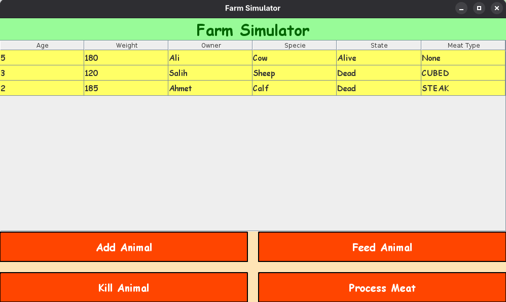

# 🚜 Farm Simulator - Animal Management System

  

A colorful and interactive farm management application that lets you track and manage animals on a virtual farm with feeding, processing, and butchering functionality.

## 🌟 Features

### 🖥️ User Interface

- **Bright, colorful UI** with orange theme and comic-style fonts
- **Interactive table** displaying all animals with their:
  - Age
  - Weight
  - Owner
  - Species (Sheep, Cow, Calf)
  - Living state (Alive/Dead)
  - Meat type (None/Steak/Cubed/Minced)

### 🐄 Animal Management

- **Add new animals** with custom attributes
- **Feed animals** to increase their weight
- **Kill animals** (converts to Steak meat)
- **Process meat** (downgrades meat quality: Steak → Cubed → Minced)

### 🪓 Butcher System

- Special butcher functionality with ID verification
- Meat processing restrictions
- Validation to prevent illegal operations

## 🎨 UI Screenshot



## 🛠️ Technical Implementation

### 📦 Package Structure

```
📂 Farm
├── Animal.java        - Core animal class with attributes and behaviors
├── Butcher.java       - Butcher functionality and meat processing
├── Farm.java          - Main farm management class
├── MeatType.java      - Enum for meat quality levels
├── Specie.java        - Enum for animal species
└── Main.java          - Entry point

📂 UI
└── FarmSimulatorUI.java - Swing-based graphical interface
```

### 🔧 Key Classes

| Class             | Purpose         | Key Methods                                                    |
| ----------------- | --------------- | -------------------------------------------------------------- |
| `FarmSimulatorUI` | Main GUI window | `addAnimal()`, `feedAnimal()`, `killAnimal()`, `processMeat()` |
| `Animal`          | Animal entity   | `eatFood()`, `kill()`, `processMeat()`                         |
| `Farm`            | Manages animals | `addAnimal()`, `feedAnimal()`, `processAnimal()`               |
| `Butcher`         | Meat processing | `processMeat()`, `isAllowedButcher()`                          |

## 🚀 Getting Started

### Prerequisites

- Java 17 or higher
- Maven (for building)

### Installation

1. Clone the repository
2. Compile the project:
   ```bash
   javac -d . Farm/*.java UI/*.java
   ```
3. Run the application:
   ```bash
   java Farm.Main
   ```

### Usage Guide

1. **Add Animals**: Click "Add Animal" and enter details
2. **Feed Animals**: Select animal, click "Feed Animal"
3. **Process Animals**:
   - First kill with "Kill Animal" (creates Steak)
   - Then process with "Process Meat" (downgrades meat quality)

## 🎨 Color Scheme

| Element           | Color           | Hex Code  |
| ----------------- | --------------- | --------- |
| Main Background   | Bright Orange   | `#FF7F00` |
| Table Background  | Light Yellow    | `#FFFF66` |
| Buttons           | Orange-Red      | `#FF4500` |
| Header            | Dark Green Text | `#006400` |
| Header Background | Pale Green      | `#98FB98` |
| Button Panel      | Moccasin        | `#FFE4B5` |

## 📝 Code Quality Features

- **Input validation** for all operations
- **Type safety** with enums (MeatType, Specie)
- **Single responsibility principle** in class design
- **Visual feedback** through UI updates
- **Error handling** with user-friendly messages

## 📜 License

MIT License - This project is open-source and available for educational use.

**Enjoy managing your virtual farm!** 🌾🐄🐑
