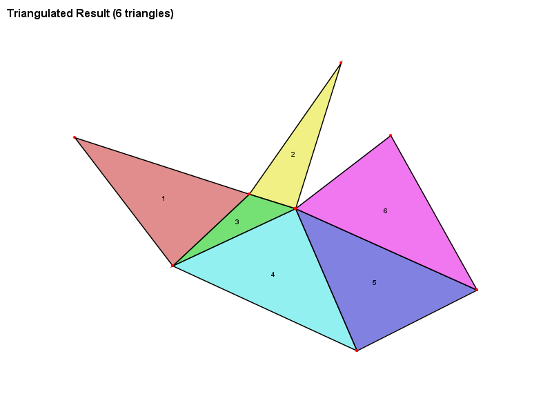
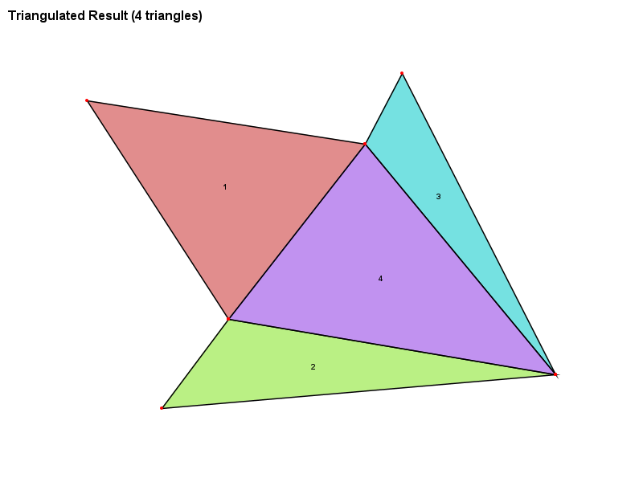
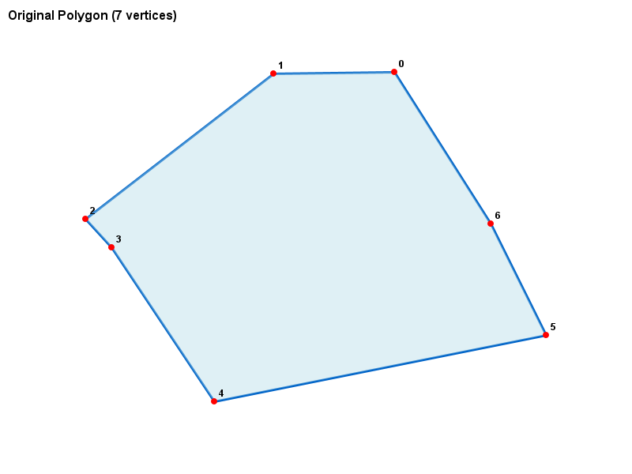
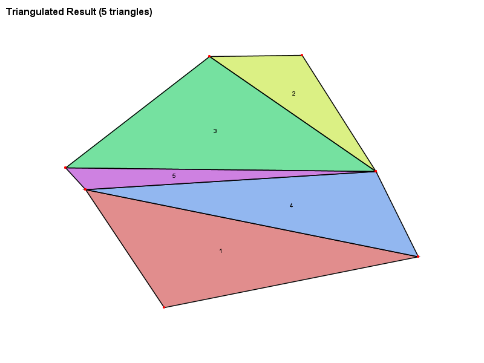
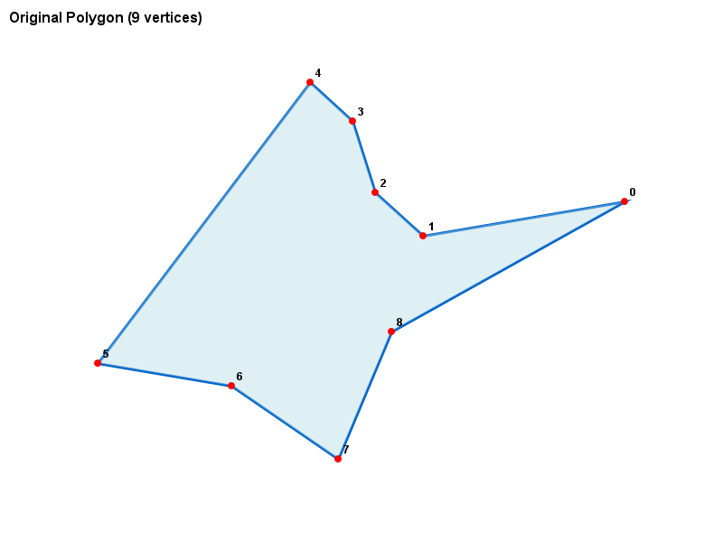
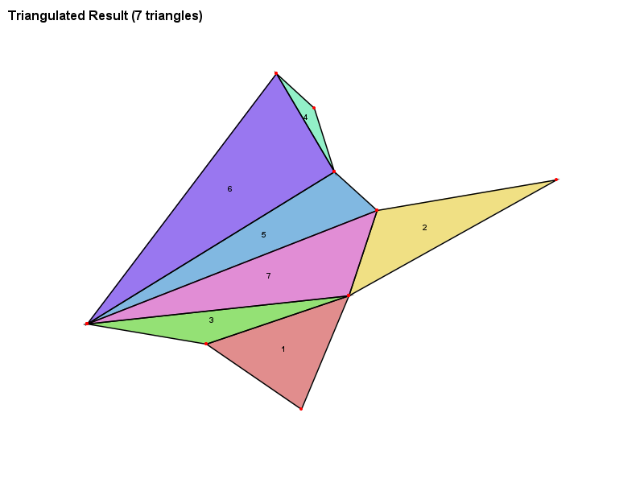

# Polygon Triangulator ( ⏹ → ▲ )




## 📌 Overview

This Java project implements a robust polygon triangulation system that processes simple polygons (both convex and concave) and decomposes them into sets of high-quality triangles. The system includes visualization capabilities, validation checks, and comprehensive reporting.

## ✨ Features

- **Polygon Processing**: Reads polygons from text files (1 vertex per line)
- **Advanced Triangulation**: Custom algorithm that avoids thin triangles
- **Visualization**: Generates images showing original polygons and triangulated results
- **Validation**: Comprehensive checks for triangulation correctness
- **Quality Metrics**: Measures triangle quality, area preservation, and more
- **Robust Error Handling**: Detailed error reporting for problematic cases

## 📂 Project Structure

```
PolygonTriangulation/
├── src/
│   ├── Geometry.java             # Abstract base class for geometric shapes
│   ├── GeometryUtils.java        # Utility methods for geometric calculations
│   ├── Point.java                # 2D point implementation
│   ├── Polygon.java              # Polygon class with area calculation and convexity check
│   ├── Triangle.java             # Triangle class with quality metrics
│   ├── TriangulationEngine.java    # Core triangulation algorithm
│   ├── TriangulationValidator.java    # Validation utilities
│   └── PolygonTriangulationApp.java    # Main application class
├── inputData/                    # Directory for input polygon files
└── outputImages/                 # Directory for generated visualization images
```

## 🛠️ Requirements

- Java 8 or higher
- Maven (for building)
- Input files in `inputData/` directory (format: one vertex per line as "x y")

## 🚀 How to Run

1. Place your polygon files in the `inputData/` directory (named 1.txt to 100.txt)
2. Compile and run the project:
   ```bash
   javac *.java
   java PolygonTriangulationApp
   ```
3. View results in the `outputImages/` directory

## 📊 Sample Output

For each polygon, the program generates:

- `X_polygon.png`: Original polygon visualization
- `X_triangles.png`: Triangulated result

Example console output:

```
=== Polygon 42 ===
+--------------------------------+------------------------------+
| Property                       | Value                        |
+--------------------------------+------------------------------+
| Vertex Count                   | 8                            |
| Area                           | 45.678923                    |
| Is Convex?                     | ✗ Concave                    |
| Triangle Count                 | 6                            |
| Time (ms)                      | 12                           |
| Triangles Area                 | 45.678921                    |
| Area Difference                | 0.000002                     |
| Degenerate Triangle Count      | 0                            |
| Minimum Triangle Area          | 3.456789123                  |
| Average Triangle Quality       | 0.782                        |
| Is Valid?                      | ✓ Passed                     |
+--------------------------------+------------------------------+
```

## 🔍 Algorithm Details

The triangulation uses a **recursive splitting approach** with these key features:

1. **Diagonal Selection**: Evaluates potential diagonals based on:

   - Edge length ratios
   - Triangle compactness
   - Avoidance of thin triangles

2. **Quality Metrics**:

   ```java
   score = (edgeRatio * 0.7) + (compactness * 0.3)
   ```

   Where:

   - `edgeRatio = minEdgeLength / maxEdgeLength`
   - `compactness = (4π*area) / perimeter²`

3. **Fallback Mechanisms**:
   - Relaxed intersection checking
   - Fan triangulation when needed

## ✅ Validation Checks

The system performs rigorous validation:

1. **Area Preservation**: Total triangle area matches original polygon area
2. **No Improper Intersections**: Triangles only touch at edges/vertices
3. **All Points Used**: No missing or extra vertices
4. **Correct Triangle Count**: n-2 triangles for n-vertex polygon

## 🌈 Visualization Examples

| Original Polygon                          | Triangulated Result                           |
| ----------------------------------------- | --------------------------------------------- |
|  |  |
|  |  |

## 📝 Input File Format

Example (`inputData/16.txt`):

```
37.57 0.21
30.69 19.13
5.06 20.36
-18.84 22.42
-10.21 12.09
26.93 -23.47
```

## 📈 Performance Metrics

The system tracks:

- Processing time per polygon
- Triangle quality metrics
- Success/failure rates across test cases

Sample summary:

```
+--------------------------------------------------------------+
|===                   Processing Summary                   ===|
+--------------------------------------------------------------+
| Successfully processed: 97 polygons                          |
| Failed to process: 3 polygons                                |
| Total attempts: 100                                          |
| Success rate: 97.0%                                          |
+--------------------------------------------------------------+
```

## 🐛 Debugging Tips

For failed cases, the system provides:

- Vertex coordinates
- Area calculations
- Convexity information
- Detailed error messages

Example debug output:

```
✗ Failed to process polygon 42: Invalid diagonal
    Debug info:
    - Vertices: 8
    - Area: 45.678923
    - Is convex: false
    - Vertices:
      [0] (0.000, 0.000)
      [1] (1.000, 0.000)
      ...
```

## 📜 License

This project is open-source and available for educational use.
